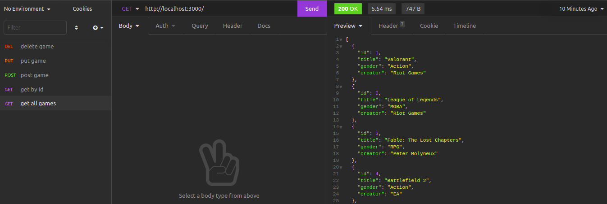

# crud-typescript

Olá!

<!-- Sobre o Projeto -->
## Sobre o Projeto
Projeto feito para treinar typescript e brincar um pouco com node enquanto isso! 😄
CRUD básico com tema Jogos 🎮

## 🖼️ Imagens do Projeto

  

## 🧰 Tecnologias e Bibliotecas

* Typescript

* Node.js

* Insomnia (Ferramenta de API REST)

## Antes de começar a testar

1. Clone o repositório

- `git clone https://github.com/ninamarq/crud-typescript/`.
- Entre na pasta do repositório que você acabou de clonar:
  - `cd crud-typescript`

2. Instale as dependências

`npm install`

3. Caso não possua nenhuma ferramenta cliente de API REST

`npm start`

- Para rodar o servidor
`npm run dev`

# Acesse http://localhost:3000 no seu navagador

Espero que gostem! 💙
